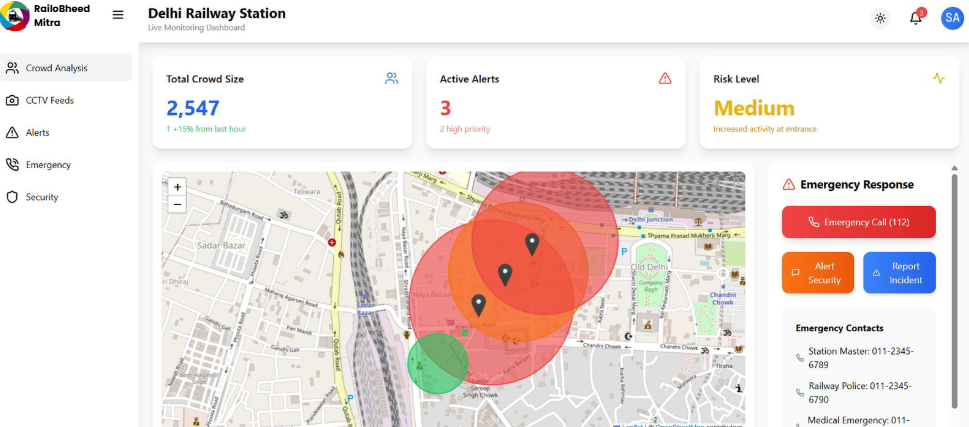
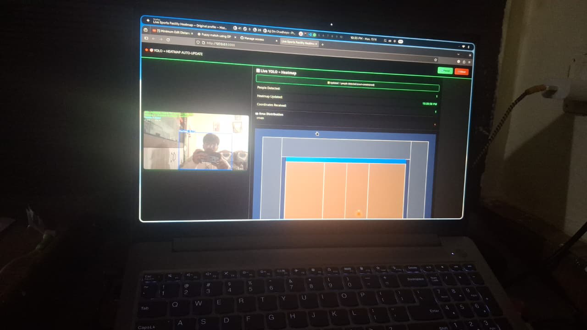

# RAILOBHEED MITRA  
Your Rail / Station Crowd Control Buddy 🚉🧠

RailoBheed Mitra is an AI-powered, real-time crowd management system designed to make railway journeys safer, smarter, and stress-free for everyone.

It tackles the critical problem of overcrowding and potential stampedes at Indian railway stations by leveraging existing CCTV infrastructure and modern AI-based video analytics.

---

## Project Vision

Our goal is to provide a complete crowd intelligence solution for Indian Railways, consisting of a centralized dashboard for officials and a passenger-facing mobile app.

The UI will offer:
- Live alerts  
- Heatmaps  
- Real-time risk analysis  

---

## Dashboard Preview (Planned UI)

---

## Current Status: Backend Core Complete

This repo hosts the fully functional backend engine:
- Real-time crowd detection  
- YOLO-based video processing  
- Live people counting  

---

## Core Engine Output

---

## Features

### Implemented
- Real-time congestion detection (YOLO-based)

### Planned
- Centralized dashboard  
- Predictive crowd control  
- Passenger awareness app  
- Automated flow management

---

## How to Run

1. Clone repo:

git clone https://github.com/ghuleaniketh/Crowd-Monitoring-System.git
cd Crowd-Monitoring-System

2. Create virtual environment:

python -m venv venv
source venv/bin/activate  (Windows: venv\Scripts\activate)

3. Install dependencies:

pip install -r requirements.txt

4. Run the detection script:

python your_main_script.py --source "path/to/video.mp4"

---

## Future Roadmap
- Dashboard integration  
- Predictive analytics  
- API layer  
- Passenger app  
- Pilot deployment at real station  

---

## Contact
RailoBheed Mitra – AI-powered crowd control system for Indian Railways
